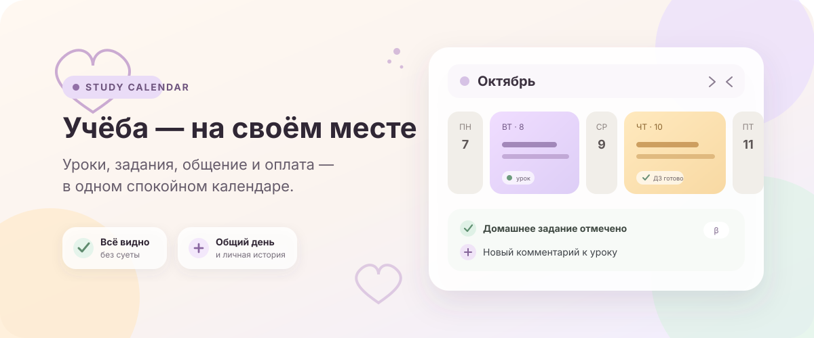
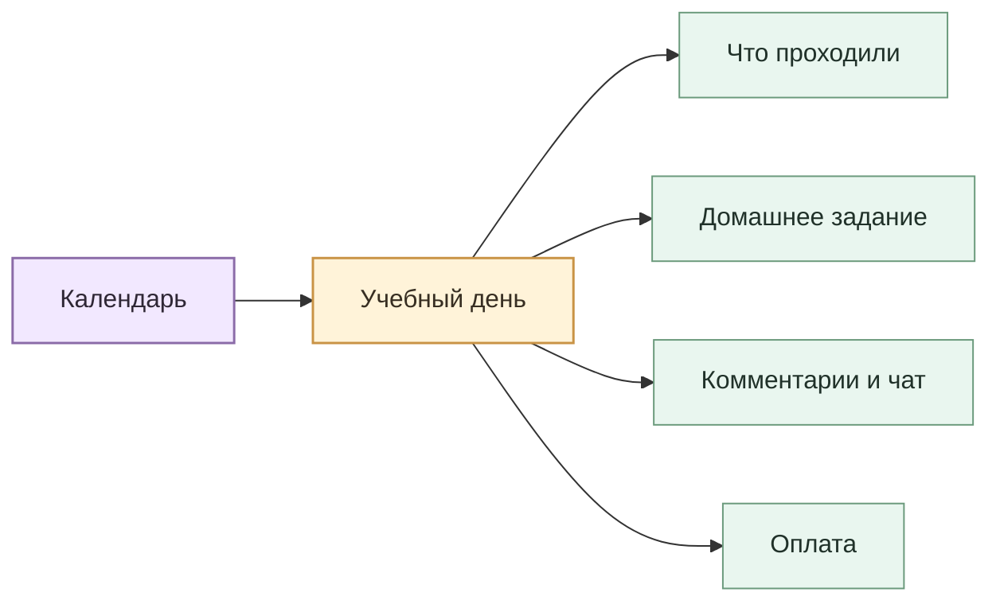

  

  # Study Calendar

  **Спокойный календарь занятий для учебного центра, детей и родителей.**

  Чтобы не искать тему урока в одном чате, домашнее задание — в другом, а дату
  оплаты — в старой переписке.

> Сейчас проект готовится к первой работающей версии. Здесь описано, каким будет
> MVP: без обещаний лишнего, но со всеми уже принятыми продуктовыми решениями.

## Всё важное — рядом с нужным днём

У каждого занятия будет своё понятное место: тема урока, то, что успели сделать
на практике, домашнее задание, оценка и обсуждение. Можно открыть день и быстро
вспомнить контекст — даже если после урока прошла неделя.

## Что увидит родитель

- когда было или будет занятие;
- какую тему проходили и что делали на практике;
- какое задано домашнее задание и отметил ли ребёнок его выполненным;
- оценку ребёнка — без публикации оценок всего класса;
- комментарии учителя и обсуждение, относящееся именно к этому уроку;
- какие занятия оплачены и где осталась задолженность.

В общий календарь можно заглянуть за жизнью класса, а в личный — за историей
своего ребёнка. Между ними не придётся искать дорогу: переходы будут прямо на
странице.

## Календарь, который показывает ритм учёбы

Дни занятий будут шире, а свободные дни — уже. Так взгляд цепляется не за пустые
клеточки, а за то, что действительно происходило. Для точного перехода к дате
останется обычный date picker.

Цвет не будет единственной подсказкой: важные состояния получат подпись, значок
или отдельную форму. Это поможет читать календарь спокойно и без угадывания.

## Общение без потерянного контекста

К теме урока, практике и домашнему заданию можно будет оставить отдельный
комментарий. У сообщений видны автор и время, комментарий можно поправить.

В чате дня ответы собираются в ветки. Вкладка появляется только у разговора, где
уже есть ответ; на виду остаются десять самых активных веток, а старые не
удаляются и возвращаются при новой активности. На поля, комментарии и сообщения
можно поставить одну из пяти простых реакций.

## Домашнее задание — без публичного сравнения детей

Ученик отмечает, что выполнил задание, а учитель ставит оценку по шкале
`α · β · γ · F`. Статус выполнения может видеть класс, но сама оценка остаётся
между ребёнком, родителями, учителем и администратором центра.

## Об оплате — ясно и без неловкости

Приложение считает деньги, а не условные «пакеты уроков». Платёж сначала
закрывает самые старые неоплаченные занятия; остаток сохраняется как аванс.
Если суммы пока не хватает, видно, сколько осталось доплатить.

В личном календаре отмечается, за какие занятия оплачено. Если платёж пришёл в
учебный день, его маркер переносится на ближайший предыдущий свободный день,
чтобы не перегружать ячейку урока, — при этом рядом всегда указана настоящая
дата платежа.

## Вход без ещё одного пароля

Войти можно будет через Telegram или Google. Сначала учебный центр создаёт
аккаунт с нужной ролью и отправляет одноразовое приглашение, поэтому ребёнок или
родитель не смогут случайно попасть в чужой класс. Второй способ входа можно
будет добавить позже из своего профиля.

## Для кого этот проект

| Мамам и папам | Детям | Учителям и центру |
| --- | --- | --- |
| Понимать, что происходит с учёбой, не собирая картину по сообщениям | Видеть свои занятия и задания в одном месте | Вести классы, уроки, обратную связь и оплаты в общем контексте |

Study Calendar рассчитан на небольшой учебный центр с индивидуальными и
групповыми занятиями. Он не пытается стать большой школьной системой — только
собрать повседневные учебные дела в одном аккуратном месте.

<strong>Для тех, кто заглянул в разработку</strong>

Проект строится на **SvelteKit**. Сейчас завершены Product Brief, Constitution и
уточнённый PRD; следующим этапом станет проектирование спецификаций и
архитектуры.

- [Product Brief](.memory-bank/analysis/product-brief.md)
- [PRD](.memory-bank/prd.md)
- [Project Constitution](.memory-bank/constitution.md)

